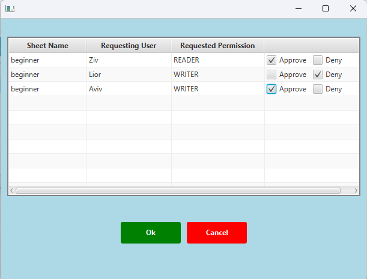

<h1 align="center">
  
   
  Welcome to Shticell
  
</h1>

<h2 align="center">
   A dynamic JavaFX-based spreadsheet application with customizable design, real-time updates, sorting, filtering, version control, and more!
           
🌟 Now with advanced analysis and design customization features! 🌟
</h2>

 

# Table of Contents
* [User Interface Overview](#user-interface-overview)
* [Core Functionalities](#core-functionalities)
* [Advanced Features](#advanced-features)
* [Upcoming Features](#upcoming-features)
* [Installation](#installation)
* [Run](#run)
* [Configuration](#configuration)
* [Credits](#credits)

 

## Project Overview
**Shticell**
is a client-server based spreadsheet application that enables multiple users to collaboratively manage and interact with spreadsheets in real-time. Built with a JavaFX client interface and a Tomcat server backend, Shticell offers a dynamic, real-time experience for users. The application supports multi-user editing, permission management, with various spreadsheet features detailed below, making it ideal for collaborative data analysis and management.

## Architecture Overview

# :computer: **User Interface Overview** <a name="user-interface-overview"/>
1. **Login Screen**:
   - The login screen allows users to enter a unique username to access the system. 
     \
     \
     

2. **Dashboard**:
   - After logging in, the user is directed to the main dashboard. Here, users can upload new sheets, request permissions to view/edit existing sheets, and manage sheet operations.
   - A table displays all available sheets in the system, showing details like uploader’s username, sheet name, size, and the user’s current permission for each sheet.
   - **Permission Requests**: When the user clicks on a sheet in the table, all pending permission requests for that specific sheet are displayed. This feature allows the user to manage and respond to permission requests directly from the dashboard, providing a streamlined way to control access to their sheets.
     \
     \
     

3. **Commands**:
   - **View Sheet**: Opens the selected sheet for viewing or editing, based on permissions.
   - **Request Permission**: Allows the user to request specific permissions for a selected sheet.
   - **Ack/Deny Permission Request**: Displays permission requests from other users for the user's sheets, allowing the user to approve or deny each request.
     \
     \
     
     \
     \
     
 

# :heavy_check_mark: **Core Functionalities** <a name="core-functionalities"/>
1. **Dynamic Spreadsheet** (available after selecting **View Sheet** from the Dashboard):
    - Real-time updates: Changes are reflected instantly.
    - Action Line Display: Provides detailed cell information including original value, effective value, and version history.
      \
      \
      
    

2. **Version Control**:
    - Track changes with version control.
    - Easily select and view previous versions, and revert if necessary.
      
   
3. **Dependency Management**:
    - Visualize cell dependencies and influences through color-coded highlights.
    - Automatic recalculation of dependent cells to ensure data integrity.
      \
      \
      

4. **Custom Design Bar**:
    - Customize background and text colors.
    - Adjust column widths and row heights dynamically for better layout and design.
      \
      \
      

5. **Range Management**:
    - **Add Range**: Users can define a new range by selecting a group of cells and saving it with a unique name. This feature helps in organizing data and applying actions to multiple cells at once.

    - **Display Range**: Users can view a previously defined range, highlighted for easy identification. This helps in visualizing groups of related data within the spreadsheet.
     
        
       

       
       
       

        
   
    - **Delete Range**: If a range is no longer needed, users can easily delete it from the system.

6. **Dynamic Analysis**:
    - Perform trend analysis on ranges of numerical values.
    - Customize range and step size for iterative calculations.
    - Visualize how changes affect dependent cells in real-time.
      \
      \
      

7. **Data Sorting and Filtering**:
    - Multi-criteria sorting: Sort data by multiple columns.
    - Filter rows based on dynamic criteria or column values, helping display relevant information quickly.

8. **Collaborative Version Management**:
   - Shticell supports real-time collaboration by allowing multiple users to work on the same spreadsheet simultaneously. When one user updates a cell, the system automatically increments the version number of the sheet.
   - Other users working on the same sheet are notified of the new version and can choose to **pull** the updated version, ensuring that everyone has the latest data. This feature maintains consistency across all active users and avoids conflicts.

      

       
       
The user has chosen to pull the updated version.

       
      

    
# :gear: **Advanced Features** <a name="advanced-features"/>

1. **Expression Handling**:
    - Support for arithmetic functions (`PLUS`, `MINUS`, `TIMES`, `DIVIDE`).
    - Logical functions (`IF`, `AND`, `OR`) for conditional behavior.
    - Cell referencing (REF): Automatically update dependent cells based on references.

2. **Custom Skins and Animations**:
    - Choose from multiple skins (green, pink, blue).
    - Enjoy interactive animations.
     
       
      

         
         
      

 

# :wrench: **Installation** <a name="installation"/>

1. Download the project files from the repository.

2. Set up the JavaFX environment in your preferred IDE (IntelliJ IDEA, Eclipse).

3. Ensure all dependencies for JavaFX are installed.

4. Install Required Libraries:
    - **JSON Library**: Add the Json library to your project dependencies.
    - **OkHttp Library**: Add the OkHttp library to your project dependencies. This is used for making HTTP requests in the client application.

5. Set Up Tomcat Server:
    - Download and install Apache Tomcat.
    - Configure Tomcat in your IDE (IntelliJ IDEA or Eclipse) to run the server.
    - Deploy the server-side part of the project to Tomcat.

6. Verify that all dependencies, including JavaFX and JSON, are installed correctly.

 

# :arrow_forward: **Run** <a name="run"/>

1. **Start the Tomcat Server**:
    - In your IDE (e.g., IntelliJ IDEA), run the server on Tomcat.
    - Ensure the server is up and running before starting the client applications.

2. **Run the `ShticellMain` Class** to start the client application:
    - You can launch multiple instances of the client by running the `ShticellMain` class in separate windows.
    - Each instance represents a different client, allowing multiple users to interact with the spreadsheet system simultaneously.

3. Once the server and client applications are running, you can begin interacting with the system through the client interface.

 

# :gear: **Configuration** <a name="configuration"/>

1. Customize skins via the **Style ComboBox** in the settings.
2. Adjust animation behaviors for a personalized experience.

# :trophy: **Credits** <a name="credits"/>
> Created by: Elizabeth Ashurov

 
